# VSE Quick Functions Addon For Blender 2.81

VSEQF is an overhaul for Blender's VSE that can completely change your workflow.  Designed for quick, mouse and keyboard balanced editing with a focus on real-time feedback.

Watch the demo video:  

Development for this script is supported by my multimedia and video production business, [Creative Life Productions](http://www.creativelifeproductions.com)  
But, time spent working on this addon is time I cannot spend earning a living, so if you find this addon useful, consider donating:  

PayPal | Bitcoin
------ | -------
 |    1JnX9ZFsvUaMp13YiQgr9V36EbTE2SA8tz  

Or support me by hiring Creative Life Productions if you have a need for the services provided.

## Installation
* Download 'VSEQuickFunctions.py', or download the release zip and extract this file.  
* Open Blender, and from the 'File' menu, select 'User Preferences'.
* In this new window, click on the "Add-ons" tab at the top.
* Click the 'Install Add-on from File...' button at the bottom of this window.
* Browse to and select the 'VSEQuickFunctions.py' file, click the 'Install Add-on from File' button.
* You should now see the addon displayed in the preferences window, click the checkbox next to the name to enable it.
* Now, below the addon information, disable or enable features by clicking the checkbox next to the name of the feature.
* Click the 'Save User Settings' button to ensure this addon is loaded next time Blender starts.

## What Can VSEQF Do?
VSEQF is designed to speed up your editing by giving you new tools, and improving the usability of Blender's built-in tools.

#### Parenting
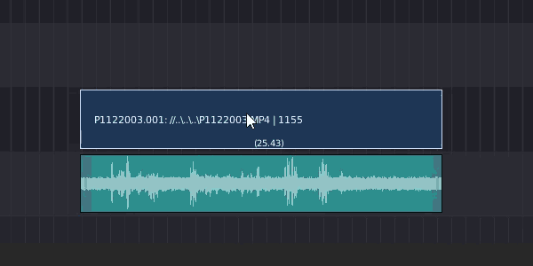  
Connect two (or more) strips together and have them behave as one.  Children will move along with the parent, be cut when the parent is cut, and even synchronize edge adjustments.

Open the parenting menu with 'Ctrl-P', or press 'Shift-P' to select children, or find parenting options in the sequencer sidebar under the 'Adjust' panel.

#### Timeline Ripple
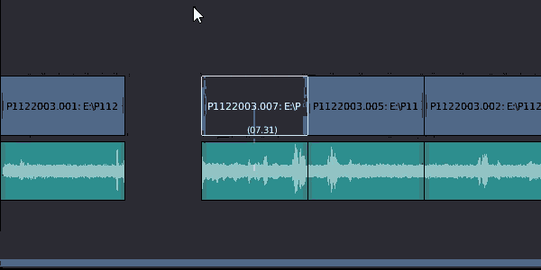  
Automatically adjust the position of strips following the current one.  Keep all the following strips in sync while you make cuts, deletes and movements.

Press 'Alt' while grabbing a strip to toggle ripple mode, or press 'Alt-Delete' to ripple delete strips.

#### Strip Cutting
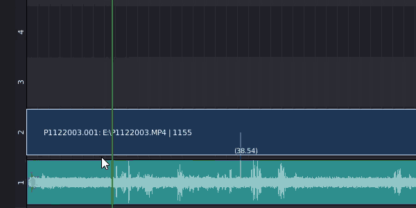  
New strip cutting menu and panel, quickly trim strips in a variety of time-saving ways.  

Press 'Ctrl-K' to open the cuts menu, or find the 'Quick Cuts' panel in the sequencer sidebar.

#### Fades And Audio Adjustments
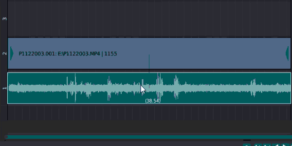  
Add, adjust or remove fades with a single click, and quickly add crossfades between strips.

Press 'F' to add or adjust fades on selected strips, press 'Shift-F' to open the fades menu, or find the 'Quick Fades' panel in the sequencer sidebar.

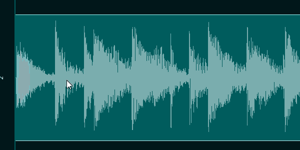  
Draw a volume curve directly over an audio strip.

Press 'V' while an audio strip is active.

#### Markers
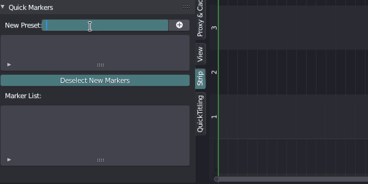  
Create marker presets to organize your timeline, jump to any markers in the timeline.

Find the 'Quick Markers' panel in the sequencer sidebar, add marker presets with 'Alt-M'.

#### Tags And Strip Markers
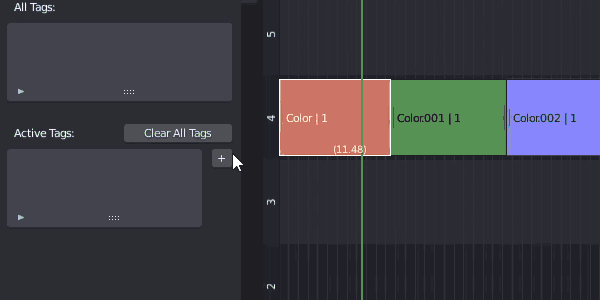  
Organize strips with tags, select strips based on a tag.

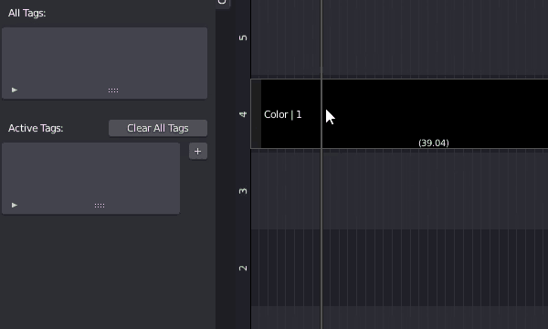  
Convert tags into strip markers to highlight a section of a strip.

Found in the 'Quick Tags' panel in the sequencer sidebar, or press 'Shift-M' to add and modifiy marker tags.

#### Context Menus
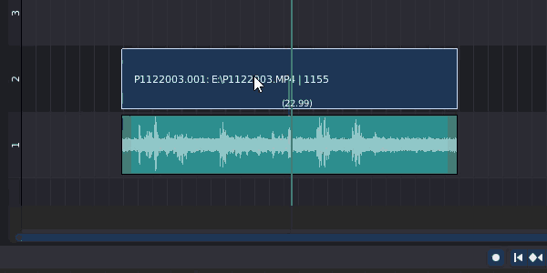  
More contextual context menus.  Easy access to options that really matter depending on what the mouse is over.

Right click while in left-click mode, or press 'W' or '`'.

#### Zoom Menus
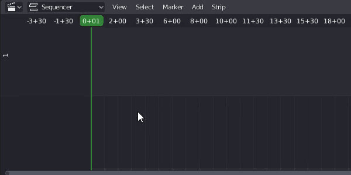  
Quickly jump to useful zoom sizes, or save and load the best zoom levels for your current project.

Press 'Z' to open the Quick Zooms menu.

#### Three Point Editing
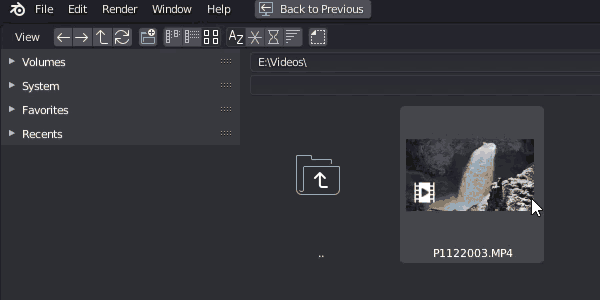  
Use movie clips like a file bin, import clips and store in/out points based on time indexes, then drop them into the timeline when you want.  

Found in the '3 Point Edit' panel in sidebar in the file browser and movie clip editor areas.

## Sequence Editor Additions
The built-in 'grab', 'select', 'cut', 'delete', 'make meta strip' and 'import' operators have been added to, this enables:

* __'Compact' Edit Panel__

   A new Edit Strip panel for the sequence editor properties area, providing more information in a smaller space than the default panel.  
   This can be enabled or disabled in the addon preferences when the addon is enabled.

* __Sequence Parenting__

   Child sequences will follow parents.
   Child edges that match the parent's edge will move along with the parent.

* __Ripple Editing__

   While in grab mode, press the alt key to toggle between ripple, ripple-pop, and normal mode.  
   Ripple mode will move all sequences after the grabbed sequence the same amount.
   Ripple-Pop will allow you to move a sequence above and out of a line, automatically closing the gap left behind.  This will only operate when one sequence is grabbed.

* __Grab Multiple With Right-Click Drag__

   Option to change the behavior of the right click drag to grab, the previous selected sequences will be added to the grab before it is activated.  
   This can be enabled in the Quick Functions Settings menu.

* __Edge Grab Improvements__

   When an edge is moved into another sequence, the selected sequence will be moved up a channel to allow the edge to be moved.  
   The cursor can be automatically snapped to a dragged edge for better adjustment.  

* __Right-Click Context Menus__

   Makes the right-click context menus more contextual, allowing different operations to be performed depending on what is clicked on.  
   Right-click and hold will open context menus when blender is in right-click to select mode.  
   See the QuickContext section for more information.

* __Making Meta Strip Additions__

   If Cut/Move Children is on, child sequences will be added to a meta strip when a parent is added.  
   Effect sequences with a single input will be automatically added to meta strips when their input sequence is added.

* __Cut Sequence Additions__

   Child sequences of a parent will be automatically cut as well as the parent.  
   Ripple cuts enabled, press Alt-K to trim and slide one side of the selected sequences.  
   Effect strips are now duplicated to both sides of a cut strip, this includes an entire effect stack.  
   Crossfades and other two-input effect strips are handled properly now. If the effect is applied to the right side of a cut, it will be applied correctly. (See https://developer.blender.org/T50877 )  
   The active strip after a cut is correctly handled now, if the mouse is on the right side of a cut, the right sequence will be active as well as selected.

* __Delete Sequence Additions__

   Deleting a sequence can also delete child sequences if enabled.  
   Ripple delete enabled, press Alt-X or Alt-Delete to delete the sequence, and move all following sequences back to fill the gap.

* __Import Additions__

   Allows the cursor to automatically move to the end of the imported sequence, allowing multiple files to be added in sequence very easily. This must be enabled in the Quick Functions Settings menu.  
   Allows automatic proxy settings to be applied to Movie and Image types while being imported.  
   Allows proxies to be automatically generated when importing a Movie or Image.  
   Allows setting the length of a single imported image in frames.  
   When a movie sequence with sound is imported, the sound may be automatically parented to the video.  
   Provides additional options for placing an imported sequence on the timeline:  

   * Import At Frame

      Standard import behavior, places new sequences at the current frame.

   * Insert At Frame

      Following sequence will be moved forward by the length of the imported sequence.

   * Cut And Insert At Frame

      All sequences at the current frame will be cut and all following sequences will be moved forward by the length of the imported sequence.

   * Import At End

      Places the imported sequences at the end of the timeline.

## QuickShortcuts
Enables quick navigation of the timeline using the number pad.  

* __Numpad: Basic Movement And Playback__

| | | |
| :---: | :---: | :---: |
|   | __/__ Cut | __*__  |
| __7__ Cursor back one second | __8__  | __9__ Cursor forward one second |
| __4__ Reverse/slower playback | __5__ Play/pause | __6__ Forward/faster playback |
| __1__ Cursor back one frame | __2__  | __3__ Cursor forward one frame |

* __Ctrl+Numpad: Advanced Movement And Jumps__

| | | |
| :---: | :---: | :---: |
|   | __/__ Cut menu | __*__  |
| __7__ Previous marker | __8__  | __9__ Next marker |
| __4__ Previous sequence edge | __5__  | __6__ Next sequence edge |
| __1__ Previous keyframe | __2__  | __3__ Next keyframe |

* __Alt+Numpad: Move Selected Strips__

| | | |
| :---: | :---: | :---: |
|   | __/__ Ripple cut | __*__  |
| __7__ Left one second | __8__ Up one channel | __9__ Right one second |
| __4__ Left 1/2 second | __5__ Grab/move | __6__ Right 1/2 second |
| __1__ Left one frame | __2__ Down one channel | __3__ Right one frame |

* __Shift+Numpad: Zoom Timeline__

| | | |
| :---: | :---: | :---: |
|   | __/__ Cut trim | __*__  |
| __7__ Zoom to 10 minutes | __8__ Zoom to selected | __9__ Zoom to all |
| __4__ Zoom to 1 minute | __5__ Zoom to 2 minutes | __6__ Zoom to 5 minutes |
| __1__ Zoom to 2 seconds | __2__ Zoom to 10 seconds | __3__ Zoom to 30 seconds |

## QuickContext
Context menus in the sequencer are more contextual based on what the mouse is over.  
Pressing the 'W' or '`' key on the sequencer will open the menu.  
When Blender is in Left-click mode, the Right-click will open this menu.  

None of the menu options are unique, some are built-in in blender, some are provided by other parts of this script.

Note that all menus start with the undo operator.

The different menu types are:

* __Sequences__

   Click on the center of a sequence to show a menu providing some settings for the active sequence, and selected sequences.  

* __Sequence Left/Right Handles__

   Click on or near the edge of a sequence to pop up a menu allowing for the changing and clearing of the fade in or out.

* __Cursor__

   Click on or near the cursor to show a menu providing some snapping options.

* __Markers__

   Click on or near a marker to show a menu providing some marker operations.

* __Empty Area__

   Click in an empty area of the sequencer to show a menu providing options to add sequences, and to zoom the sequencer.

## Quick3Point
__Warning: This is very much alpha, it will likely change quite a bit in future versions, and may even be removed and put into another addon.__  
To use this properly, your screen layout should have a file browser area, a movie clip editor area, and at least one sequencer area.  __This function may not work correctly if all these areas are not present.__  

If sequence that shares the same source as a loaded clip is active, that clip will be displayed in the clip editor.  

When a video file is selected in the file browser, a new panel is added to the tools panel, '3 Point Edit'. The 'Import To Clip Editor' button will load the selected video file into the clip editor area.  

The clip editor now has a new panel in the properties panel, '3 Point Edit'.  
To use the following options, the clip does not need to have been loaded via the filebrowser button, any movie clip will work.  

* __Set In/Out__

   A graphic overlay will be created in the clip editor allowing for easy setting of the in and out points of the current clip. Drag the top arrow to set the left ('in') point, and the lower arrow to set the right ('out') point.  
   While in this mode, press the spacebar to play/pause the video.  
   You can drag the playback position at the bottom of the clip editor.  
   Left click anywhere else, or press enter to confirm the changes.  
   Right click or press escape to cancel the changes.  

* __Minutes In, Seconds In, Frames In__

   Set these values to manually adjust the in point for the clip (how much will be removed from the beginning).  
   Adjusting the frames greater than the total frames in a second will increment the seconds, and adjusting the seconds greater than 59 will increment the minutes.  
   If the length is at the maximum possible (end of the clip), it will be reduced as the in point is increased.  

* __Minutes Length, Seconds Length, Frames Length__

   Use these values to set the length of the clip, after the in point.  
   If these values are increased beyond the endpoint of the clip, they will be snapped back to the end.  

* __Import At Cursor__

   Basic import into the sequencer timeline at the current cursor location.  
   No other sequences will be moved.  

* __Replace Active Sequence__

   If an active sequence is in the VSE, it will be deleted and replaced by the imported sequence.  
   Sequences after the replaced one will be moved forward or back to accommodate the length of the new sequence.  
   If the active sequence is a movie with a child sound sequence that is the same length and origin file, it will be replaced as well.  
   All parent data will be changed to reflect the new sequence.  

* __Insert At Cursor__

   The new sequence will be placed at the cursor location, and all trailing sequences will be moved forward by the length of the new sequence.  

* __Cut Insert At Cursor__

   Similar to Insert At Cursor, but all sequences will be cut before inserting, ensuring that nothing overlaps the new sequence.  

* __Import At End__

   Places the new sequence at the end of the timeline.  

## QuickFades
Enables one-click adding or changing a fade-in or fade-out.  
Also enables one-click crossfading between multiple strips.
Adds a fade adjustment function to provide visual feedback while editing fades directly in the sequencer.

#### Fades Panel
The 'QuickFades' panel provides buttons for setting and removing fades.  
Can be found in the sequence editor properties panel, or by pressing the 'shift-f' key over the sequencer.  
Detected fades will also be shown on the active strip in the timeline, or in the edit strip properties panel.  Fades will be automatically moved if the edges of the strip are changed.
If context menus are enabled, fades can be set by right clicking on the edges of a strip.  

* __Fade Length__

   The target length for fade editing or creating.  
   This can be set to 0 to remove a fade.

* __Set Fadein/Set Fadeout__

   Allows easy adding and changing of fade in/out.  The script will check the curve for any fades already applied to the sequence (either manually or by the script), and edit them if found.  
   These buttons can apply the same fade to multiple selected sequences at once.

* __Clear Fades__

   Remove fades on all selected strips.

* __Transition Type__

   Selects the type of transition for adding with the following buttons.

* __Crossfade Prev/Next Sequence__

   Allows easy adding of transitions between sequences.  This will simply find the closest sequence to the active sequence, and add a transition between them.

* __Smart Cross to Prev/Next__

   Adjust the length of the active sequence and the next sequence to create a transition of the target fade length.  
   This will also attempt to avoid extending the sequences past their end points if possible.

#### Fades Modal Operator
The Modal Fades Operator can be activated by pressing the 'f' key over the sequencer.  
This will apply fades to all selected strips. If only the strip is selected, it will default to applying fades to both edges, if a strip edge is selected, it will default to applying a fade only to that edge.  
To effectively use this operator, you must be able to see the beginning or and of the selected strips.  

While the operator is running:
* Move the mouse up to increase the fades on all edges.
* Move the mouse down to decrease fades on all edges.
* Move the mouse left or right to slide fades left or right.
* Press 'F' or Middle-Mouse to switch fade mode (both edges, only one edge).
* Type in an integer value to set all fades to that value.  

When you are satisfied with the fade positions, left-click or press enter to confirm, or right-click or press escape to cancel.  

## QuickSnaps
A menu for extra cursor and strip snapping functions.

Can be found in the sequence editor 'Strip' menu, or by pressing the 's' key over the sequencer.  
If context menu is enabled, some snaps will be found on right clicking the cursor, and some while right clicking strips.

* __Cursor To Nearest Second__

   Will round the cursor position to the nearest second, based on framerate.

* __Jump To Previous/Next Sequence__

   Snap the cursor to the previous or next sequence in the timeline.

* __Cursor To Beginning/End Of Active__

   Will move the cursor to the beginning or end of the active sequence.

* __Selected To Cursor__

   Snaps the beginning of selected strips to the cursor.  This is the same as the 'shift-s' shortcut in the VSE.

* __Selected Beginning/End To Cursor__

   Moves all selected sequences so their beginning/end is at the cursor.

* __Selected To Previous/Next Sequence__

   Detects the previous or next sequence in the timeline from the active sequence, and moves the active sequence so it's beginning or end matches the other sequence's end or beginning.

## QuickZooms
A menu with zoom shortcuts.

Can be found in the sequence editor 'View' menu, or by pressing the 'z' key over the sequencer.  
If context menus are enabled, can be found by right clicking in an open area.

* __Zoom All Strips__

   Zooms the sequencer out to show all sequences.

* __Zoom To Timeline__

   Zooms the sequencer to the timeline start and end.

* __Zoom Selected__

   Zooms the sequencer to show the currently selected sequence(s).

* __Zoom Cursor__

   Zooms the sequencer to an amount of frames around the cursor.

* __Size__

   How many frames should be shown by using Zoom Cursor. Changing this value will automatically activate Zoom Cursor.

* __Save Current Zoom__

   Saves the current zoom level and view position in the presets menu.

* __Zoom Presets__

   Submenu containing saved presets. Click the 'X' next to each preset to remove it, or click 'Clear All' to erase all presets.

* __Zoom (Time Lengths)__

   Several preset zoom values for convenience.

## QuickParents
This implements a parenting system for sequences, any children of a moved or cut sequence will have the same operations performed on them.  
If the sequence is cut, any children under the cursor will be cut as well, and the script will duplicate parent/child relationships to the cut sequences.  
If the parent sequence is resized and a child sequences have the same endpoints, they will be resized as well.

Can be found in the sequence editor properties panel under "Edit Strip", or by pressing the 'Ctrl-p' key over the sequencer.  
If context menus are enabled, the QuickParents popup menu will be shown when right clicking a sequence as well.  
Children or Parents of selected sequence will be shown in these places.

Parenting relationships are show in the timeline view for the active sequence, a light line indicates children of the active sequence, a dark line indicates a parent of the active sequence.

* __Select Children or Parent (Small Selection Button)__

   Selects any related sequences to the current sequence.  
   Also can be accomplished with the shortcut 'Shift-p'.

* __Clear Children or Parent (Small X Button)__

   Removes relationships from selected sequence.

* __Set Active As Parent__

   If multiple sequences are selected, this will set selected sequences as children of the active (last selected) sequence.

* __Cut/Move Sequence Children__

   Enables parenting operations on child sequences.

* __Auto-Select Children__

   When a parent sequence is selected, child sequences will be selected as well.

* __Auto-Delete Children__

   When a parent sequence is deleted, all children will be deleted as well.

These settings can also be found in the Quick Functions Settings menu.

## QuickProxy
Automatically sets proxies for imported strips, and optionally can generate them automatically as well.

All settings for QuickProxy are found in the Quick Functions Settings menu.

* __Enable Proxy On Import__

   Enables the given proxy settings on any compatible sequence type when it is imported.

* __Auto-Build Proxy On Import__

   Starts the proxy building process on imported sequences.  
   Will only function if Enable Proxy On Import is active.  
   This will cause a performance hit on Blender as it is generating the proxies in the background.

The other settings are standard proxy settings, see the Blender help documentation for information on them.

## QuickMarkers
Add markers to the timeline using name presets, or quickly jump to and remove any marker.  

Can be found in the sequence editor properties panel under 'QuickMarkers', also Alt-M in the sequencer.

* __New Preset__

   Enter a marker title into the text field, and click the + button to add a preset.

* __Place A Marker__

   Click on a marker button once a preset has been added to add a marker with this name at the current cursor location.  
   Adding a marker in the location of a previously existing marker will rename the marker to the marker preset name.

* __Remove A Preset__

   Click the X button next to a preset to remove it.

* __Deselect New Markers__

   With this enabled, newly created markers will be unselected to prevent accidental moving.

* __Marker List__

   Click a marker title to jump the cursor to this marker.  
   Click the X button next to a marker to delete it.

## QuickTags
Create tags, text snippets that can describe sequences, and apply them to any sequences in the timeline.  All sequences with a specific tag can be easily selected with one click.

* __All Tags__

   This list shows all tags on all sequences in the timeline.  
   Click a tag to select all sequences with that tag.  
   Click the '+' button to add that tag to all selected sequences.

* __Active Strip__

   Shows a list of tags for the active sequence.
   Click a tag to select all sequences with this tag.
   Click the 'X' button to remove the tag from the active sequence.

* __Selected Strips__

   Shows a list of tags for all selected sequence.
   Click a tag to select all sequences with this tag.
   Click the 'X' button to remove the tag from all selected sequences.

* __New Tag__

   Type a tag into the field, and press the '+' button to add to all selected strips.  This tag will now show up in the 'All Tags' list as well.

* __Clear Active/Selected Strip Tags__

   Removes all tags from the active or selected sequences.

## QuickCuts
Provides a quick interface for basic and advanced cutting and trimming functions.

* __Cut All Sequences__

   If enabled, all sequences under the cursor (besides locked sequences) will be affected by any button in this panel.  
   If disabled, only selected sequences will be affected.

* __Frames To Insert__

   When the 'Cut Insert' function is used, the number of frames here will be inserted.

* __Cut__

   Basic soft cut function, equivalent to the 'K' shortcut in the VSE.

* __Cut Insert__

   Performs a soft cut, then slides all sequences following the cut down the timeline by the amount of frames defined in the 'Frames To Insert' variable.

* __UnCut Left/UnCut Right__

   Merges a selected sequence with the one to the left or right if they are from the same source file, and have not been slid on the timeline.  
   Useful for 'undoing' an accidental cut.

* __Delete__

   Removes selected sequences from the timeline.

* __Ripple Delete__

   Removes selected sequences from the timeline, and attempts to remove any empty space left behind.

* __Trim Left/Right__

   Removes any part of the selected sequences to the left or right of the cursor.

* __Slide Trim Left/Right__

   Removes any part of the selected sequences to the left of the cursor, then slides the remaining sequence back or forward to where the original edge was.

* __Ripple Trim Left/Right__

   Trims one side of the selected sequences, then slides the sequence, and all following sequences back to attempt to fill the empty space

* __Timeline To All__

   Sets the start and end points of the VSE timeline to fit all sequences loaded in.

* __Timeline To Selected__

   Sets the start and end points of the VSE timeline to fit the currently selected sequences. 

* __Start To All/End To All__

   Sets only the start or end of the VSE timeline to fit all sequences.

* __Start To Selected/End To Selected__

   Sets only the start or end of the VSE timeline to fit the selected sequences.

* __Full Timeline Setup__

   Moves all sequences back so they start on frame 1, then sets the start and endpoints of the timeline so they encompass all sequences.

# Known Problems
I welcome any help with these problems, if you have an idea on how to fix them, please contact me.

* Sometimes undo pushing breaks, it may add extra undo steps.  Not sure whats going on here...

* Uncut does not work on movieclip type sequences, this seems to be a limitation in Blender - there appears to be no way to get the sequence's source file.

* Right now the script cannot apply a vertical zoom level, as far as I can tell this is missing functionality in Blenders python api.

# Future Possibilities
These are things I want to add, but I don't yet know how to do so.

* Ripple insert (opposite of ripple pop).  Not entirely sure how to code this yet, but I want it!

* Copy/paste wrapper that will copy sequence animation data.

# Changelog
### 0.86
   * Fixed transparency in title scenes
   * Fixed no sequences in a scene throwing an error
   * Added auto-parenting of movie sequences with sound
   * Cleaned up quicklist, meta strips now list sub-sequences, effects are indented under the parent sequence

### 0.87
   * Continuous functions should work inside meta strips now
   * Fixed a couple small bugs

### 0.88
   * Added drop shadows to titler
   * Added color picker and material duplicate button to titler
   * Hopefully fixed continuous functions from throwing errors when no strips are loaded
   * Improved adding/changing fades, added a clear fades button

### 0.89
   * Fixed zoom to cursor not working inside meta strips
   * Fixed zoom to cursor not working in Blender 2.74
   * Fixed child sequences being moved twice if they were manually moved along with the parent
   * Recoded continuous function - parenting is more reliable, all cut sequences are detected and parented properly, fades are now moved when a sequence is resized
   * Removed continuous snapping, snapping is now built-in in blender as of 2.73
   * Added quick zoom presets
   * Added settings to hide different Quick panels
   * Added QuickParenting option to auto-select child sequences, also child sequences' endpoints will be moved when a parent is resized if they match up.
   * Added font loading button to QuickTitler
   * Added templates to QuickTitler
   * Added display modes for QuickList
   * Cleaned and commented code

### 0.89.1
   * Removed an extra check in the modal function that wasn't doing anything but slowing down the script

### 0.9
   * Split QuickTitling off into its own addon
   * Cleaned up variables
   * Improved child sequence auto-select: handle selections are now duplicated as well
   * Parenting is now stored in a sequence variable of .parent
   * Rewrote continuous modal operator to hopefully fix incorrect detections of add/cut/resize/move
   * Now uses addon preferences to enable or disable features (list, fades and parenting)
   * Edit panel displays fade in/out
   * Parenting panel is simplified and merged into the edit panel
   * Improved crossfade adding
   * Added Quickproxy to automatically enable proxies on imported sequences
   * Added Quickmarkers to add markers to the timeline with a preset name
   * Rewrote the continuous function AGAIN, to now be a handler - this means movement/resizing of child clips is now in real-time, and fades are continuously updated.  Also, switching scenes shouldn't have any adverse affect on the script.
   * New variables added to sequence strips to help track changes: .last_frame_final_start, .last_frame_start, .last_frame_final_duration, .last_select, and .new
   * Child sequences can now be automatically deleted when deleting a parent
   * Renaming a clip should now fix the relationships
   * QuickRipple implemented to enable timeline ripple-style editing, still new and buggy
   * Improved performance by only checking sequences in current editing scope (not checking sequences inside meta strips if not in that meta strip)

### 0.91
   * Added QuickBatchRender to automatically separately render out sequences.  Still in beta, needs testing.
   * Fixed custom zooms freaking out ripple mode
   * Added option to correct the active strip when cutting (if you cut with mouse on the right, active strip remains on left even tho right is selected)
   * Updated panel layouts a bit
   * Fixed ripple thinking meta-ed strips are deleted
   * Ripple delete now moves the cursor with moved strips
   * Ripple delete should now preserve strip channels when possible
   * Child strips now try to follow vertical movement of parent strips, but still get pushed out of the way by other strips
   * Fixed zoom presets being wrong sometimes
   * Moved some settings around to streamline panels a bit
   * Fixed QuickList time index display

### 0.92
   * Added QuickTags for adding metadata text tags to strips
   * Reworked QuickList interface
   * Added reverse sorting in QuickList
   * Added ability to switch strip with previous/next in QuickList
   * Revamped QuickMarkers UI, also adding a marker over a current marker will now rename the current marker
   * Added QuickCuts, a panel and menu for specialized cutting operations and easy timeline adjustments
   * More code cleanup and documentation of functions and classes
   * Reworked frame skipping, can now play in reverse when active, and should work better with slow playback

### 0.93
   * Added seconds offset and seconds position display to edit panel
   * Added 'compact' edit strip panel, displays more information in a smaller space than the original
   * Added categories to panels
   * Implemented new function wrappers, many features should now be more reliable, and new small features are added
      * New 'Grab' operator - parenting and ripple features are reliable now, press 'Alt' to toggle ripple mode
      * New 'Select' operator - can now right-click-drag multiple files
      * New 'Cut' operator - parenting and ripple is now properly handled
      * New 'Delete' operator - can ripple delete, and can remove children, New ripple delete shortcut - Alt-Delete and Alt-X
      * New 'Meta Make' operator - automatically adds child strips to new metastrip
      * New strip importer operator - has some new features and will auto-parent and auto-generate proxies
   * Replaced the sequencer Strip and Add menus so they can use the custom operators, also new option to simplify strip menu by removing some items
   * New ripple cut shortcuts - Alt-K will ripple trim the strip based on which side the mouse is on
   * Minimized continuous function handler, only needs to detect new strips and renames now
   * Implemented graphic display of fades and parent/child relationships of the active strip
   * Cursor following is back, works properly at all zoom levels now!
   * Implemented Quick3Point - a basic 3point editing workflow, import from the file browser to the clip editor, then to the sequencer.
   * Auto-Set Timeline Operator - move strips up to frame 1, set timeline start to frame 1, set timeline end to last frame of last strip
   * The new cut operator now fixes effect sequence chains - it will duplicate single input effects (such as speed control) to the newly cut sequence, and it will fix crossfades that should be applied to the right cut sequence.  See https://developer.blender.org/T50877 for more info on the bug.
   * Now can save and recall zoom levels in the vse.  No way to do vertical (channel) zooms yet tho...
   * Right-click context menu option added, hold right click to activate it.  Options will differ depending on what is clicked on - cursor, sequence, sequence handles, markers, empty area

### 0.94
   * Frame skipping now works with reverse playback as well, and fixed poor behavior
   * Added QuickShortcuts - timeline and sequence movement using the numpad.  Thanks to tintwotin for the ideas!
   * Added option to snap cursor to a dragged edge if one edge is grabbed, if two are grabbed, the second edge will be set to the overlay frame.
   * Many improvements to Quick3Point interface
   * Fixed a bug that would cause slipped sequences to jump around
   * Split Quick Batch Render off into its own addon
   * Fixed bug where adjusting the left edge of single images would cause odd behavior
   * Significant improvements to cursor following
   * Improvements to ripple behavior, fixed bugs relating to it as well
   * Improved marker grabbing behavior
   * Improvements to Quick3Point
   * Added display of current strip length under center of strip
   * Fixed canceled grabs causing waveforms to redraw
   * Improved QuickTags interface
   * Reworked ripple delete, it should now behave properly with overlapping sequences

### 0.95
   * Updated for Blender 2.8 - lots of code changes, lots of bug fixes, updated menus, updated panels
   * Disabled ripple and edge snap while in slip mode
   * Various optimizations to ripple and grabbing
   * Added support for left and right click mouse moves
   * Updated frame skipping to work with new limitations in Blender
   * Added a modal fade operator for easily setting/changing fades, moved fades menu to shift-f
   * Strip information is now drawn for all selected strips, not just active

